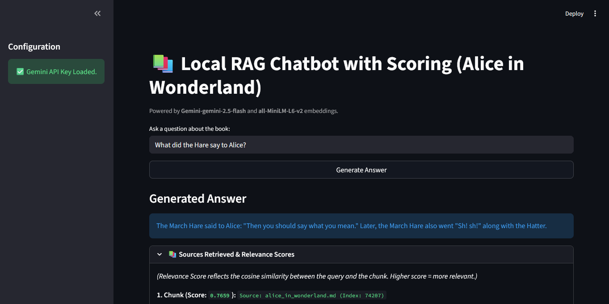
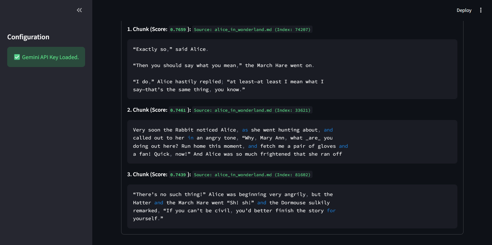

# Local RAG Chatbot with Chroma, HuggingFace & Gemini

**Educational → In-depth**  
This repository demonstrates a local Retrieval-Augmented Generation (RAG) pipeline that uses:

- **Chroma** (local vector DB) for storing embeddings,
- **HuggingFace local embeddings** (`all-MiniLM-L6-v2`) for semantic vectors,
- **Gemini** (Google Generative AI) as the optional LLM for final answer generation, and
- **Streamlit** as a lightweight UI to interact with the pipeline.

> The code is designed to work **locally** (embedding & retrieval) and optionally with Gemini (if you supply a `GOOGLE_API_KEY` / `GEMINI_API_KEY`). If no API key is present, the app runs in **retrieval-only** mode and shows contextual chunks and relevance scores.

---

## Project structure

```

project-root/
│── app.py                     # Streamlit RAG app (UI + scoring)
│── create_database.py         # Builds Chroma DB from data/books/*.md
│── query_data.py              # CLI script to run RAG queries (console)
│── compare_embeddings.py      # Small script to test embeddings & evaluator
│── data/
│   └── books/
│       └── *.md               # Markdown files used to build the DB
│── chroma/                    # Chroma DB (created by create_database.py)
│── Images/                    # Screenshots for README (Streamlit UI outputs)
│── requirements.txt
│── README.md
│── .env                       # (not committed) store GOOGLE_API_KEY or GEMINI_API_KEY

```

---

### Architecture (Educational Overview)

At a high level, the RAG pipeline works like this:

+----------+      +--------------------------+
|  Query   | -->  | HF Embeddings (Vectorize)|
+----------+      +--------------------------+
                         |
                         v
                 +----------------+
                 | Chroma Search  |
                 +----------------+
                         |
                         v
                 +----------------+
                 |  Top-k Chunks  |
                 +----------------+
                         |
                         v
                 +----------------+
                 |  Rerank (Cos)  |
                 +----------------+
                         |
                         v
                 +------------------------+
                 | Build RAG Prompt + LLM |
                 +------------------------+
                         |
                         v
                 +----------------+
                 | Final Answer   |
                 +----------------+


1. **Embed**: The query is converted to a dense vector using a local HuggingFace embedding model (`all-MiniLM-L6-v2`).
2. **Search**: That vector is used to query the local Chroma vector store (`k=3` by default).
3. **Rerank**: Retrieved chunks are re-scored with cosine similarity vs. the query embedding for a transparent relevance score.
4. **Generate**: If a Gemini API key is present, the system constructs a RAG prompt (context + question) and sends it to Gemini to produce an answer. Otherwise it displays the retrieved contexts for manual inspection.

---

## Cosine similarity (what it measures)

Cosine similarity gives a value in `[-1, 1]` (but for typical embeddings from sentence-transformers it's between `0` and `1` for related semantics). Implementation in the code:

```py
def cosine_similarity(vec_a: np.ndarray, vec_b: np.ndarray) -> float:
    dot_product = np.dot(vec_a, vec_b)
    norm_a = np.linalg.norm(vec_a)
    norm_b = np.linalg.norm(vec_b)
    if norm_a == 0 or norm_b == 0:
        return 0.0
    return dot_product / (norm_a * norm_b)
```

- **Higher score** → more semantically similar.
- The UI shows each chunk with a score to help you understand which bits of context the model relied on.

---

## Scripts & responsibilities

- **`create_database.py`**

  - Loads `data/books/*.md` (UTF-8), splits documents into overlapping chunks with `RecursiveCharacterTextSplitter`, embeds them using `HuggingFaceEmbeddings`, and persists into `chroma/`.
  - Run this once (or whenever your source corpus changes) to rebuild the DB.

- **`app.py`**

  - Streamlit app: loads the Chroma retriever, accepts questions, calls Gemini when key is present, and displays answers plus scored sources in an expander.
  - Provides retrieval-only fallback when no API key is found.

- **`query_data.py`**

  - CLI script for running a single query from the terminal. Useful for quick tests or automation.

- **`compare_embeddings.py`**

  - Small utility to sanity-check local embeddings and run a pairwise evaluator. Useful to confirm embedding lengths and semantic distances.

---

## Setup (Python 3.10)

> Recommended: create and activate a virtual environment.

```bash
# Create venv (unix / mac)
python3.10 -m venv .venv
source .venv/bin/activate

# Windows (PowerShell)
python -m venv .venv
.venv\Scripts\Activate.ps1
```

Install packages:

```bash
pip install -r requirements.txt
```

> If you run into `torch` wheel issues, install the correct CPU/GPU wheel from the official PyTorch instructions for your platform, then re-run `pip install -r requirements.txt` to satisfy the remaining packages.

---

## Environment variables

Create a `.env` file in the project root (do NOT commit `.env` to git).

```bash
# .env
GOOGLE_API_KEY=<your-google-api-or-gemini-key>
# or
GEMINI_API_KEY=<your-key>
```

- If neither variable exists, the app runs **retrieval-only**.
- If the key exists, the app will use Gemini to generate natural-language responses.

---

## Quick usage

### 1) Build the DB

Put Markdown files into `data/books/` (`*.md`) and then:

```bash
python create_database.py
```

Expected output: creation of `chroma/` directory and a message confirming saved chunks.

### 2) Run Streamlit UI

```bash
streamlit run app.py
```

Open the URL printed by Streamlit (usually `http://localhost:8501`) and use the text input to ask questions.

### 3) Query from CLI

Without Gemini key (retrieval-only):

```bash
python query_data.py "What did Alice say to the Cheshire Cat?"
```

With key in `.env`, the CLI will return a Gemini-generated answer and the sources used.

---

## Screenshots

Replace these placeholders with your real screenshots in `Images/`:

- `Images/streamlit_main.png` — main UI with input and generated answer
- `Images/streamlit_sources.png` — sources expander showing scored chunks

You can embed them in this README with:

```md


```

---

## Troubleshooting & tips

**Chroma DB not found / load errors**

- Ensure `create_database.py` ran successfully and created `chroma/`.
- Confirm `data/books/*.md` exists and is UTF-8 encoded.

**Embeddings are slow or OOM**

- By default the code forces the embedding model onto CPU (`model_kwargs={'device': 'cpu'}`).
- If you have a GPU and want to use it, update `model_kwargs={'device': 'cuda'}` and ensure `torch` has CUDA support installed.

**Gemini/API errors**

- Make sure `.env` contains `GOOGLE_API_KEY` or `GEMINI_API_KEY`.
- If you see network or auth errors, verify the key permissions and that your network allows outbound HTTPS.

**Vector similarity scores are low**

- Use a couple of sample queries and inspect retrieved chunks manually.
- If the corpus is small, try lowering `chunk_size` or adding more domain text.

---

## Performance tuning & customization

- **Change `k`**: In `get_retriever()` (app) and `query_data.py`, you can change `search_kwargs={"k": 3}` to a higher number to retrieve more context.
- **Tweak splitter**: `RecursiveCharacterTextSplitter(chunk_size=300, chunk_overlap=100)` — change chunk size/overlap depending on document structure.
- **Embedding model**: `all-MiniLM-L6-v2` is compact and fast. For better semantic quality, swap to a larger sentence-transformer (at cost of compute).
- **Caching**: `@st.cache_resource` is used for caching retriever in Streamlit. Clear cache or restart the app when you re-create the DB.

---

## Developer notes (why certain choices were made)

- **Local embeddings + Chroma** keep the pipeline privacy-preserving and cheap.
- **Retrieval-only fallback** allows you to explore local relevance before enabling the LLM.
- **Reranking with cosine similarity** makes the retrieval transparent and explains which chunks influenced the answer.
- **Streamlit UI** is minimal and effective for iterative development and debugging.

---

## Security & ethics

- Do **not** commit credentials to Git. Use `.env` and `.gitignore`.
- Be careful when sharing results produced by the LLM — verify factual claims against the original text if correctness matters.

---

## Future improvements (suggested)

- Add unit tests for `cosine_similarity`, `split_text`, and retriever loading.
- Add a small Dockerfile that pins CPU wheels and reproduces the environment.
- Implement async retrieval + batching for large corpora.
- Add an evaluation harness to compute retrieval+generation metrics (EM, ROUGE, etc.).

---

## License & attribution

MIT

---

````

**Notes & installation tips**

1. The `torch` wheel is the most platform-sensitive package. If you use CPU-only, you may prefer installing `torch` using the command recommended on the official PyTorch site for your OS (for example: `pip install torch --index-url https://download.pytorch.org/whl/cpu` OR the specific CPU/GPU wheel). After installing the correct `torch` wheel, run:

```bash
pip install -r requirements.txt
````

2. If you run into dependency resolution issues, try creating a fresh venv, installing `torch` first (as appropriate), then install the remaining requirements.

3. If you want **looser version ranges** (to avoid hard pinning during experimentation), replace `==` pins with `>=` for less strict resolution, e.g., `langchain>=0.2.2`.
